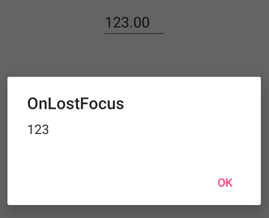

# Events in Xamarin Numeric Entry (SfNumericTextBox)

## Value changed event in SfNumericTextBox

You can perform operation while the changing the value of [`SfNumericTextBox`](https://help.syncfusion.com/cr/xamarin/Syncfusion.SfNumericTextBox.XForms.SfNumericTextBox.html) value using [`ValueChanged`](https://help.syncfusion.com/cr/xamarin/Syncfusion.SfNumericTextBox.XForms.SfNumericTextBox.html#Syncfusion_SfNumericTextBox_XForms_SfNumericTextBox_ValueChanged) event. ValueChanged event returns the changed value in NumericTextBox.

<table>
<tr>
<th>Members</th>
<th>Description</th>
</tr>
<tr>
<td>Value</td>
<td>Displays changed value in NumericTextBox</td>
</tr>
</table>





    <syncfusion:SfNumericTextBox ValueChanged="Handle_ValueChanged" Value="123"  />
    




SfNumericTextBox numericTextBox=new SfNumericTextBox();
numericTextBox.Value = 123;
numericTextBox.ValueChanged += Handle_ValueChanged;
this.Content=numericTextBox;

void Handle_ValueChanged(object sender, Syncfusion.SfNumericTextBox.XForms.ValueEventArgs e)
{
    System.Diagnostics.Debug.WriteLine(e.Value.ToString());
}





## Interactivity : ValueChangeMode in SfNumericTextBox

The [`ValueChangeMode`](https://help.syncfusion.com/cr/xamarin/Syncfusion.SfNumericTextBox.XForms.SfNumericTextBox.html#Syncfusion_SfNumericTextBox_XForms_SfNumericTextBox_ValueChangeMode) property is used to mention when the validation should occur, either in key pressed or in focus lost. When ValueChangeMode is set to [`OnKeyFocus`](https://help.syncfusion.com/cr/xamarin/Syncfusion.SfNumericTextBox.XForms.ValueChangeMode.html#Syncfusion_SfNumericTextBox_XForms_ValueChangeMode_OnKeyFocus), the validation occurs for each key press. When ValueChangeMode is [`OnLostFocus`](https://help.syncfusion.com/cr/xamarin/Syncfusion.SfNumericTextBox.XForms.ValueChangeMode.html#Syncfusion_SfNumericTextBox_XForms_ValueChangeMode_OnLostFocus), the validation occurs when the control loses focus or moves the focus to the next control. ValueChangeMode includes the following options:

1. [`OnKeyFocus`](https://help.syncfusion.com/cr/xamarin/Syncfusion.SfNumericTextBox.XForms.ValueChangeMode.html#Syncfusion_SfNumericTextBox_XForms_ValueChangeMode_OnKeyFocus)
2. [`OnLostFocus`](https://help.syncfusion.com/cr/xamarin/Syncfusion.SfNumericTextBox.XForms.ValueChangeMode.html#Syncfusion_SfNumericTextBox_XForms_ValueChangeMode_OnLostFocus)

### OnKeyFocus in SfNumericTextBox





	<syncfusion:SfNumericTextBox ValueChangeMode="OnKeyFocus" Value="123" ValueChanged="SfNumericTextBox_ValueChanged" />
	




SfNumericTextBox numericTextBox=new SfNumericTextBox();
numericTextBox.Value = 123;
numericTextBox.ValueChanged += NumericTextBox_ValueChanged;
numericTextBox.ValueChangeMode = ValueChangeMode.OnKeyFocus;
this.Content=numericTextBox;

private void SfNumericTextBox_ValueChanged(object sender, Syncfusion.SfNumericTextBox.XForms.ValueEventArgs e)
{
    DisplayAlert("OnKeyFocus", e.Value.ToString(), "OK");
}





### OnLostFocus in SfNumericTextBox





	<syncfusion:SfNumericTextBox ValueChangeMode="OnLostFocus" Value="123"  ValueChanged="SfNumericTextBox_ValueChanged" />
	




SfNumericTextBox numericTextBox = new SfNumericTextBox();
numericTextBox.Value = 123;
numericTextBox.ValueChanged += NumericTextBox_ValueChanged;
numericTextBox.ValueChangeMode = ValueChangeMode.OnLostFocus;
this.Content = numericTextBox;

private void SfNumericTextBox_ValueChanged(object sender, Syncfusion.SfNumericTextBox.XForms.ValueEventArgs e)
{
    DisplayAlert("OnLostFocus", e.Value.ToString(), "OK");
}





## Completed event in SfNumericTextBox

Raised the [`completed`](https://help.syncfusion.com/cr/xamarin/Syncfusion.SfNumericTextBox.XForms.SfNumericTextBox.html#Syncfusion_SfNumericTextBox_XForms_SfNumericTextBox_Completed) event when the user finalizes the text in the [`SfNumericTextBox`](https://help.syncfusion.com/cr/xamarin/Syncfusion.SfNumericTextBox.XForms.SfNumericTextBox.html) by pressing return key on the keyboard.





    <syncfusion:SfNumericTextBox Completed="Handle_Completed”/>
    




SfNumericTextBox numericTextBox=new SfNumericTextBox();
numericTextBox.Completed += Handle_Completed;
this.Content=numericTextBox;

void Handle_Completed(object sender, System.EventArgs e)
{
System.Diagnostics.Debug.WriteLine("Completed");      
}





## See also

[How to change the SfNumericTextBox style using its visual states]( https://www.syncfusion.com/kb/11785/how-to-change-the-xamarin-forms-numeric-textbox-style-using-its-visual-states)

[How to define and apply a common style for SfNumericTextBox]( https://www.syncfusion.com/kb/11670/how-to-define-and-apply-a-common-style-for-sfnumerictextbox-in-xamarin-forms)
