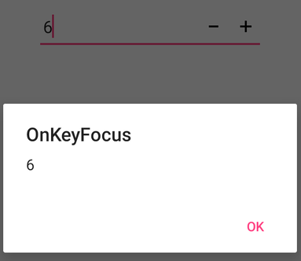
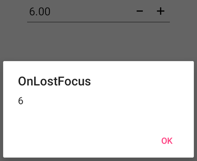

# Events and Interactivity in Xamarin NumericUpDown (SfNumericUpDown)

## Events

### ValueChanged 

You can perform any operation when changing the value of NumericUpDown using the ValueChanged event. The ValueChanged event returns the changed value in NumericUpDown.

For example you can restrict the NumericUpDown value if it exceed's greater than 3 digits using following code.





    <syncfusion:SfNumericUpDown x:Name="NumericUpDown" ValueChangeMode="OnKeyFocus" ValueChanged="Handle_ValueChanged" Value="123"  />
    




SfNumericUpDown NumericUpDown=new SfNumericUpDown();
NumericUpDown.Value = 123;
NumericUpDown.ValueChangeMode = ValueChangeMode.OnKeyFocus;
NumericUpDown.ValueChanged += Handle_ValueChanged;
this.Content=NumericUpDown;

string updateValue = "";
void Handle_ValueChanged(object sender, Syncfusion.SfNumericUpDown.XForms.ValueEventArgs e)
{
    if (e.Value.ToString().Length <= 3 && e.Value != null)
    {
       updateValue = e.Value.ToString();
    }
    else
    {
       updown.Value = updateValue.ToString();
    }
}





## Interactivity : ValueChangeMode

The ValueChangeMode property is used to mention when value needs to update, either in key pressed or focus lost state. When ValueChangeMode is set to OnKeyFocus, the value will be updated on each key press. When ValueChangeMode is set to OnLostFocus, the value is updated when the control lose the focus or the focus is moved to the next control. ValueChangeMode includes the following options:

1. OnKeyFocus
2. OnLostFocus

### OnKeyFocus





	<syncfusion:SfNumericUpDown ValueChangeMode="OnKeyFocus" x:Name="NumericUpDown"  Value="123"  />
	




SfNumericUpDown NumericUpDown=new SfNumericUpDown();
NumericUpDown.Value = 123;
NumericUpDown.ValueChangeMode = ValueChangeMode.OnKeyFocus;
this.Content=NumericUpDown;





### OnLostFocus





	<syncfusion:SfNumericUpDown ValueChangeMode="OnLostFocus" x:Name="NumericUpDown"  Value="123"  />
	




SfNumericUpDown NumericUpDown=new SfNumericUpDown();
NumericUpDown.Value = 123;
NumericUpDown.ValueChangeMode = ValueChangeMode.OnLostFocus;
this.Content=NumericUpDown;





### Completed 

This event occurs when users finalize the text in the NumericUpDown by pressing the return key(enter, ok) on keyboard.





    <syncfusion:SfNumericUpDown x:Name="NumericUpDown" Completed="Handle_Completed”/>
    




SfNumericUpDown NumericUpDown=new SfNumericUpDown();
NumericUpDown.Completed += Handle_Completed;
this.Content=NumericUpDown;

void Handle_Completed(object sender, System.EventArgs e)
{
  System.Diagnostics.Debug.WriteLine(“Completed”);         
}




